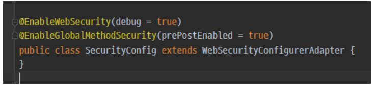
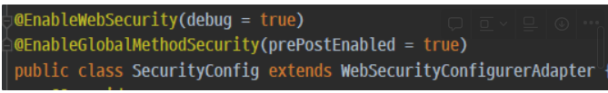
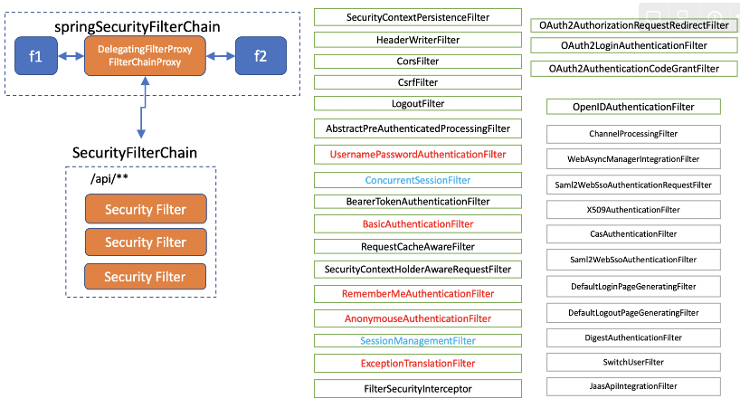
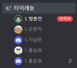

주차별 회고 작성 파일입니다

## 팀 구성원

---

[팀장] 오현직, 지남은, 홍준표, 홍승표, 정종민

## 회고 내용 요약 (최소 500자 이상)

---

### 인가 혹은 권한

- 사용자가 누구인지 알았다면 사이트 관리자 혹은 시스템은 로그인한 사용자가 어떤 일을 할 수 있는지 권한을 설정한다.
- 권한은 특정 페이지에 접근하거나 특정 리소스에 접근할 수 있는 권한 여부를 뜻한다.

### 권한의 어노테이션

- Secured
- PrePostAuthorize

→ 이러한 어노테이션 권한을 체크하는 것이 있다.

```java
@RequestMapping("/auth")
    public Authentication auth(){
        return SecurityContextHolder.getContext()
                .getAuthentication();
				// auth로 들어가면 사용자의 정보를 Authentication 객체로 반환한다.
				// 즉 화면에 Json 형태로 뿌려주게 된다.
    }

// @PreAuthorize는 권한을 체크 하는 것이다. 그래서 ADMIN 권한이 있는 사람만 맵핑 되어 있는
// 곳을 확인 할 수 있다.
// 하지만 SecurityConfig의 설정을 통해 @PreAuthorize를 쓸 수 있다.
@PreAuthorize("hasAnyAuthority('ROLE_ADMIN')")
    @RequestMapping("/admin")
    public SecurityMessage admin(){
        return SecurityMessage.builder()
                .auth(SecurityContextHolder.getContext().getAuthentication())
                .message("Admin 정보")
                .build();
    }
```
### SecurityConfig class ( 스프링 시큐리티의 설정 하는 곳 )


- `@EnableWebSecurity` : Securiy 설정이다 라는 것을 알려주는 것이다.
- `@EnableGlobalMethodSecurity` : prePostEnabled 를 true로 할 시 @PreAuthorize를 사용하여 권한을 체크할 수 있다.
- `WebSecurityConfigurerAdapter` : 일단 Web에 대한 Security를 위한 설정이라고 생각

```java
protected void configure(AuthenticationManagerBuilder auth) throws Exception {
        auth.inMemoryAuthentication()
                .withUser(User.builder()
                        .username("user2")
                        .password("2222")
                        .roles("USER")
                ).withUser(User.builder()
                        .username("admin")
                        .password("3333")
                        .roles("ADMIN"))
        ;
    }
```
### 비밀번호 인코더

```java
package com.sp.fc.web.config;

import org.springframework.context.annotation.Bean;
import org.springframework.security.config.annotation.authentication.builders.AuthenticationManagerBuilder;
import org.springframework.security.config.annotation.method.configuration.EnableGlobalMethodSecurity;
import org.springframework.security.config.annotation.web.configuration.EnableWebSecurity;
import org.springframework.security.config.annotation.web.configuration.WebSecurityConfigurerAdapter;
import org.springframework.security.core.userdetails.User;
import org.springframework.security.crypto.bcrypt.BCryptPasswordEncoder;
import org.springframework.security.crypto.password.PasswordEncoder;

@EnableWebSecurity(debug = true)
@EnableGlobalMethodSecurity(prePostEnabled = true)
public class SecurityConfig extends WebSecurityConfigurerAdapter {
    @Override
    protected void configure(AuthenticationManagerBuilder auth) throws Exception {
        auth.inMemoryAuthentication()
                .withUser(User.builder()
                        .username("user2")
                        .password(passwordEncoder().encode("2222"))
                        .roles("USER")
                ).withUser(User.builder()
                        .username("admin")
                        .password(passwordEncoder().encode("3333"))
                        .roles("ADMIN"))
        ;
    }

    @Bean
    PasswordEncoder passwordEncoder(){
        return new BCryptPasswordEncoder();
    }
}
```

- 이런 식으로 직접 비밀번호를 encode를 해주면 정상적으로 USER와 Admin 권한을 가진 사용자가 생성이 된다.

### 스프링 시큐리티의 페이지 접근에 대한 기본 값

```java
@Override
    protected void configure(HttpSecurity http) throws Exception {
        http.authorizeRequests((requests) ->
                requests.anyRequest().authenticated());
        http.formLogin();
        http.httpBasic();
    }
```

- `(requests) ->  requests.anyRequest().authenticated());` : 모든 요청을 인증 받은 상태에서 접근을 하라.

### 스프링 시큐리티의 페이지 접근에 대한 접근을 해제하는 방법

```java
@Override
    protected void configure(HttpSecurity http) throws Exception {
        http.authorizeRequests((requests) ->
                requests.antMatchers("/").permitAll()
                        .anyRequest().authenticated());
        http.formLogin();
        http.httpBasic();
    }
```

- `requests.antMatchers("/").permitAll()` : (”/”) 로 접근 했을 때 모든 사람(인증 받지 않은 사람)이 접근을 허용하게 만듦
- 유저를 임시적으로 추가하기 위한 설정이다.
- username : 사용자의 아이디를 뜻한다.
- password : 사용자의 비번을 뜻한다.
- roles : 사용자의 권한을 뜻한다.

<aside>
💡 하지만 이렇게 유저를 만든 경우는 오류가 난다. 왜냐하면 비밀번호를 인코더 안했기 때문이다.

</aside>

## 서블릿 컨테이너

- 톰켓과 같은 웹 어플리케이션을 서블릿 컨테이너라고 부른다.
- 필터는 request 공통적으로 동작하는 것(세션, 인코딩)들을 주로 필터를 위치한다.
- 그래서 method 까지 도착을 하려면 필터를 다 거쳐야한다.
- 즉 톰캣은 필터를 차례로 거쳐서 DispatchServlet을 통해 url이 매칭 되는 Controller의 메소드를 찾아 실행이 된다.

## 서블릿 컨테이너에서는 Spring security가 어떻게 되어 있을까?

- DelegatingFilterProxyFilterChainProxy(프락시) : 스프링 시큐리티 대리자
- 프락시를 통해 어떤 필터를 거칠지 결정할 수 있다.
- 밑에 사진에 상속 되어 있는 것이 하나의 SecurityFilterChain이라고 볼 수 있다.
  


- 그래서 필터를 거치게 할지 안할지도 결정할 수 있고, 필터에 대한 설정을 할 수 있다.



- 각각의 필터는 단일 필터 단일 책임(?) 원칙 처럼, 각기 서로 다른 관심사를 해결합니다.
- SecurityConfig에서 `@EnableWebSecurity(debug = true)`를 주었을 때 어떤 필터를 거쳤는 지 확인해 볼 수 있다.
- 어떤 request에서 필터 체인을 거칠 것인지의 설정은 `http.antMatcher("특정 URL 주소"`)라고 하면 된다.
- 또한 필터 체인을 하나 더 걸고 싶으면 SecurityConfig class를 또 하나 만들고, 어떤 필터를 먼저 거칠 지 `@Order(1)`를 걸어 주면된다. ( `@Order(1)`은 제일 먼저로 필터를 거친다는 뜻이다. )


## 회고 과정에서 나왔던 질문 (최소 200자 이상)


### 스프링 시큐리티에서 session은 어디서 가져오고 처리를 하게 되는 것일까?

- SecurityContextPersistenceFilter라는 곳에서 내부적으로 처리가 된다.
- SecurityContextPersistenceFilter는 SecurityContext(접근 주체와 인증에 대한 정보)가 있으면 그걸 사용가져오고 없으면 새로 만든다.
- SecurityContext는 기본 적으로 HttpSession에서 가져오게 된다.
- 즉 정리하자면 로그인할 때 Session 저장소(?)에서 Session Id를 쿠키에다 저장해서 유저한테 보내준다. 만약에 없다면 새로 만들게 된다.
- 쿠키로 저장된 Session Id로 SecurityContext 를 통해 찾고, 유저의 대한 정보를 제공하게 된다.
- 그래서 쿠키에 Session 아이디가 저장되어 있는 것을 제거 하면 사용자가 자동으로 로그아웃이 된다.

## 회고 인증샷 & 팀 자랑

---

### 인증샷 입니다!


### 자랑멘트
- 팀 내에서 각자 기능을 구현할 것을 분담화 하여서 그 기능 구현에 대해 어려움이 생기지 않게 스스로 공부해오고, 바로 저희 프로젝트에 구현 해보는 식으로 하고 있습니다!
- 그래서 매번 공부해온 것을 직접 구현 해보니 학습 효과가 더욱 더 뛰어납니다!
- 그리고 모르는 것이 있으면 팀원 분들한테 매번 물어보고 해결합니다!
