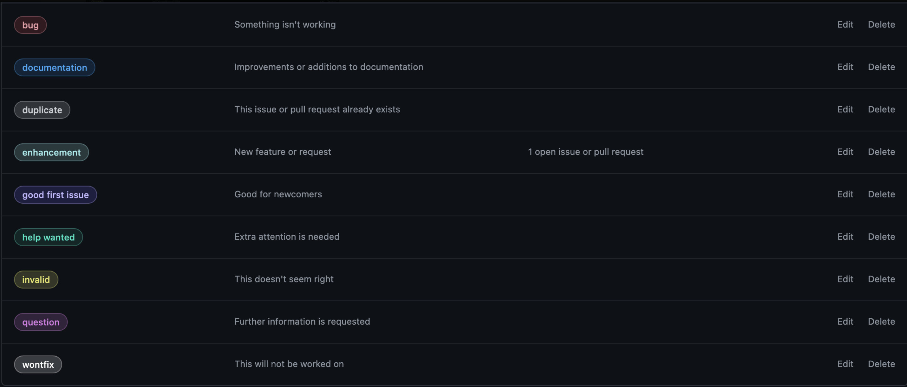
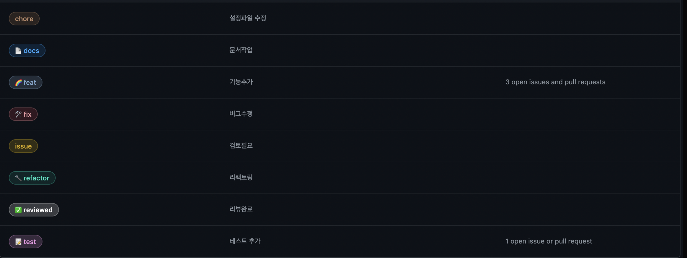
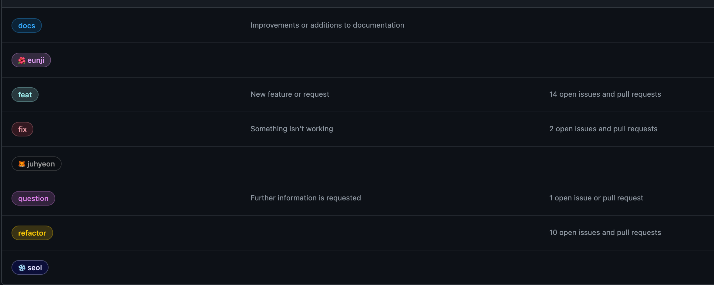

# 1주차 위클리 진행사항

## 팀 구성원, 개인 별 역할

---

- 오현직 `팀장`
- 정종민
- 지남은
- 홍승표
- 홍준표

> **현재 프로젝트에 대한 구체적인 역할 정하지 않음**

## 팀 내부 회의 진행 회차 및 일자

---

예) 1회차(2022.08.01) 구글 밋 진행, (OOO님 불참)

- 일주일 간 진행한 내부 회의 횟수와 일자, 진행 방법, 불참 인원을 위와 같이 작성해 주세요.

- 1회차(2022.08.01) 디스코드 타이레놀 방 (전원 참석)

- 2회차(2022.08.02) 디스코드 타이레놀 방 (전원 참석)

- 3회차(2022.08.03) 디스코드 타이레놀 방 (전원 참석)

- 4회차(2022.08.04) 디스코드 타이레놀 방 (전원 참석)

- 6회차(2022.08.08) 디스코드 타이레놀 방 (전원 참석)

  - github-flow 규약에 대해서 준비한 것을 설명

  - Thymeleaf 스터디를 진행함

- 7회차(2022.08.09) 디스코드 타이레놀 방 (전원 참석)

  - github-flow 규약에 대해서 준비한 것을 설명

- 8회차(2022.08.10) 디스코드 타이레놀 방 (전원 참석)

  - Issue 부여 및 Github 칸반보드 및 Label 설정 및 추가 설정 진행

### github-flow

```
** 일단 local에 있는 dev 브랜치는 건드는 것이 아니다. **

** feature 브랜치를 파서 기능을 추가한다.**

0. git pull origin dev -> `fetch + merge == pull`

1. 인텔리제이에서 feature 브랜치를 생성한다.
명령어:
git switch -c feature/#이슈번호-해야할 일의 키워드
or
git checkout -b feature/#이슈번호-해야할 일의 키워드

2. 작업
항상 작업이 완전히 다 끝나지 않는 이상 로컬에만 Commit을 진행한다.

3. 작업 완료
인텔리에지에서 작업이 잘 되는지 확인을 해야한다.
git push origin feature/#이슈번호-해야할 일의 키워드

4. github에 와서 pull request 작성
- 꼭! This closes #이슈번호

5. dev로 브랜치를 옮기고 feature/#이슈번호-해야할 일의 키워드를 삭제한다.

0. git pull origin dev
```

### 주의 사항

- `도중의 다른 사람이 작업을 하면 merge를 진행하는 것이 아니라 항상 git pull origin dev를 진행하면 된다.`
- 이 때 로컬의 dev랑 위치가 다르지만 상관 쓰지말자!
- local에 존재하는 dev는 브랜치를 팔 때만 checkout 한 후
- git pull origin dev를 진행하자.

즉, local dev 브랜치에 나의 작업물을 직접 merge, rebase 하는 일은 없다!!

## 현재까지 개발 과정 요약 (최소 500자 이상)

---

1. DB

   1. ERD 설계
      - 8월 2일 프로젝트의 전체적인 ERD를 팀원들과 작성
      - 초기 프로젝트 구축에 필요한 유저, 유저 게시물, 관리자 테이블, 운동시설\_정보 테이블, 유저 게시물 댓글 테이블 등 5개 테이블 ERDCLOUD 로 제작
      - 후일 기능 확장을 통해 테이블 구성 변경 예정임
   2. MyBatis vs JPA
      - 점프투 스프링부트에서 사용하는 JPA 를 선택
      - 쿼리문이 익숙치 않은 팀원들이 JPA 를 사용함으로서 간편하게 db 데이터 다룰 수 있을것으로 기대
      - MyBatis, JPA의 간략적 특징
        | MyBatis | JPA |
        | ---------------------------------------------------------------- | ---------------------------------------- |
        | 자바에서 SQL Mapper를 지원해주는 프레임워크 | 자바 ORM의 기술 표준 |
        | SQL문을 이용해서 RDB에 접근, 데이터를 객체화 | CRUD 메소드 기본 제공 |
        | 복잡한 쿼리문 작성 가능 | 쿼리를 만들지 않아도 됨 |
        | 객체와 쿼리문 모두 관리해야함, CRUD 메소드를 직접 다 구현해야함. | but 복잡한 쿼리는 queryDsl로 해결할 예정 |

2. 협업
   1. 초기 ~ 현재(08/08)
      - 각각에 팀원들이 사용위한 개인 브랜치 생성
      - 팀원이 단위개발 완성물을 dev 브랜치와 merge를 하고 이상이 없으면 dev로 PR하는 형식
   2. 현재 이후(08/08) ~
      - github-flow 로 전환
3. 프론트(**Thymeleaf**)
   - 초기에 **JSP**와 **Thymeleaf** 중에 딱 정해지지 못해서 강사님께 조언을 구한 결과 앞으로의 교육과정에 Thymeleaf를 배우게 되고 JSP 와 Thymeleaf 두개다 다뤄본 경험을 얻기 위해 Thymeleaf를 선택하라는 권유를 받아서 Thymeleaf로 정함
4. 프로젝트 들어가기 위한 사전 공부(8/10일까지)
   1. 점프투 스프링부트 3장까지 각자 팀원들이 공부를 함으로서 프로젝트 들어가기전 최소한의 역량을 쌓기위해 목표

## 개발 과정에서 나왔던 질문 (최소 200자 이상)

---

- 팀원이 담당한 단위 개발을 dev 브랜치로 PR을 하기전에
  팀원들 끼리 코드리뷰를 하는 방법을 찾을 필요가 있음 - 문제점 : 개인이 완성한 단위개발물을 통합 브랜치로 PR 후 본인이 직접 merge를 하면, 팀원들 끼리 코드리뷰를 할 수도 없는 문제점 존재.

- 프론트 관련 언어 선택

  - 강사님께 조언을 구한 결과 만약 현업이었으면, JSP 를 사용하라고 권유했을거라함, 이유는 당장의 완성물을 만들어야하기 때문

  - **JSP**와 **Thymeleaf** 어느것을 선택해도 결과물을 만들어내는데 문제는 없다고 말씀함

## 개발 결과물 공유

---

Github Repository URL: [https://github.com/likelion-backendschool/hellpyending](https://github.com/likelion-backendschool/hellpyending)

ERD cloud URL : [https://www.erdcloud.com/d/9MkKfoh3uEQGo2Zsc](https://www.erdcloud.com/d/9MkKfoh3uEQGo2Zsc)1

## 결정 한 것들

1. label 결정

<center>
   1번(default)



2번(custom)



3번(custom)



</center>

> ✔ : custom

---

2. 테이블 이름

에약어인 password 및 user

- password : user_passwrod
- user : users vs user_info

> Users 로 채택

3. 커밋 메세지

\#이슈번호(한칸)-(한칸) 어떠한 일에 간략한 키워드 (한 줄 띄고) `ex) #71 - 유저 엔티티 컨트롤러 구현`

#71 - feat: 유저 엔티티 컨트롤러 구현
중
#71 - 유저 엔티티 컨트롤러 구현

```
어떠한 것들에 대한 세부적인 내용 정리
* ref 이런식으로 reference 공유
```

4. Pull Requset

제목: ISSUE 제목과 동일시

```
- 로컬 실행은 슬랙 알림이 안 오도록 했습니다.
- .env.dev에서 NODE_ENV 변수 지워주세요
- message에 환경 확인할 수 있도록 추가했습니다.
```

5. Discussion, Merge -> code Review -> message, Accept, (2)

discussion-> Discord, Notion
